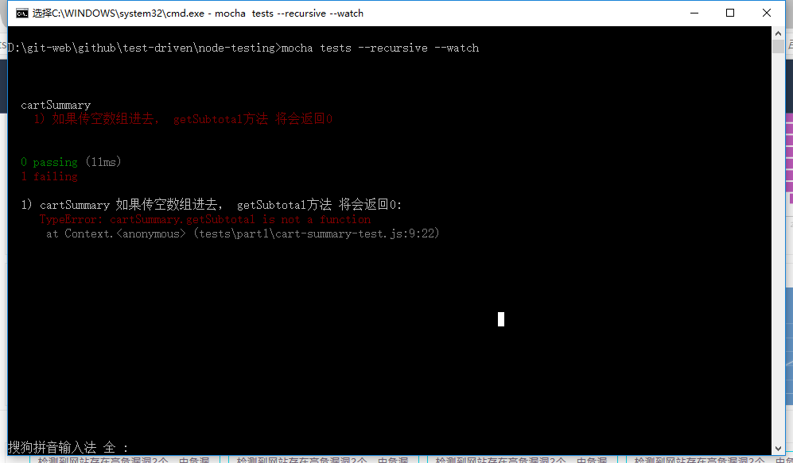
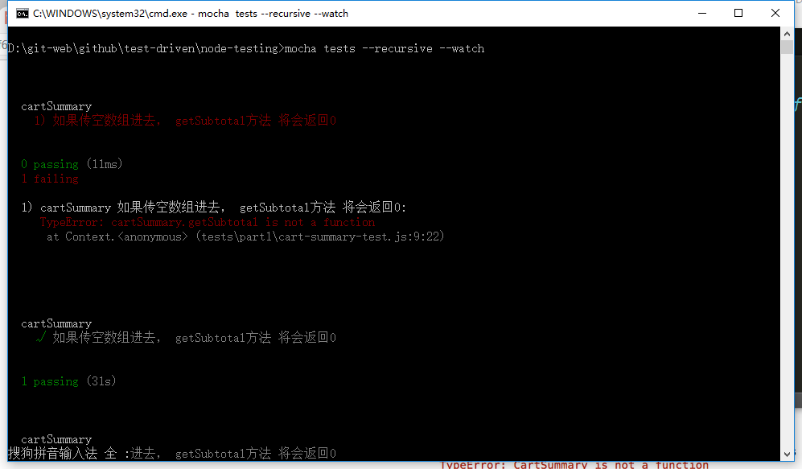
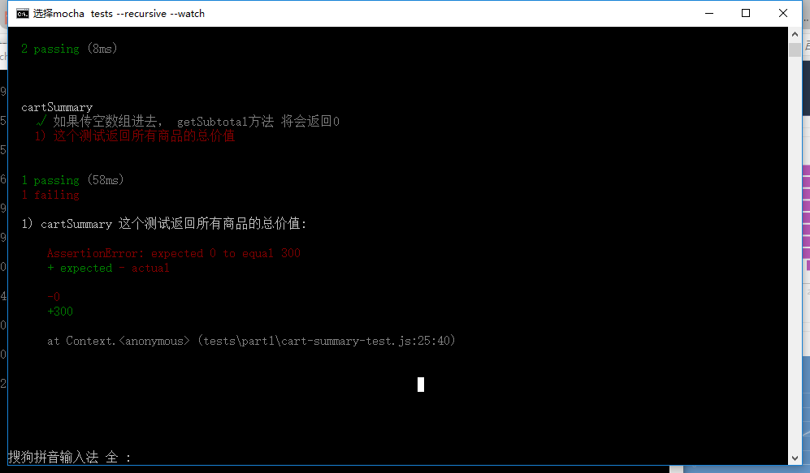

# Nodejs的测试和测试驱动开发
测试是保证软件质量必不可少的一环。测试有很多形式：手动、自动、单元测试等等。这里我们只聊使用Mocha这个框架在Nodejs中实现单元测试。单元测试是测试等重要组成，这样的测试只对于一个方法，这样的一小段代码，实施有针对的测试。

这里会逐步深入的讲解单元测试。首先是最简单的单元测试，没有外部依赖，只有简单的输入。接着是实用Sino框架实现stub等有依赖的测试。最后讲解如何单元测试异步代码。

文／uncle_charlie（简书作者）
原文链接：http://www.jianshu.com/p/abf6551d72b3
著作权归作者所有，转载请联系作者获得授权，并标注“简书作者”。


** [参考链接](http://www.jianshu.com/p/abf6551d72b3) **

## 安装Mocha 和Chai
安装Mocha：
```
npm install mocha －g
```
Mocha和其他的javascript单元测试框架，如：jasmine和QUnit不同，他没有assertion库。但是，Mocha允许你实用你自己的。最流行的Assertion库有should.js、expect.js和Chai，当然Nodejs内置的也可以使用。这里我们用Chai。

首先创建一个package.json并安装Chai：
```
npm install chai --save-dev
```
Chai包含三种assertion方式：should方式、expect方式和assert方式。个人喜欢expect式的，所以下面就使用这个方式了。

## 第一个Test

[项目代码](https://github.com/hairichuhe/test-driven)

第一个例子，我们用测试驱动开发（TDD）的方式创建一个CartSummary的构造函数，这个函数会用来计算购物车的商品总数。测试驱动开发就是在实现功能之前先写单元测试，这样来驱动你设计可以与测试相适应的代码。

测试驱动开发的步骤：

    写一个测试，并且这个测试会失败。
    写最少的代码来使整个测试可以通过。
    重复。

来看代码：
```
// tests/part1/cart-summary-test.js
var chai=require('chai');
var expect=chai.expect;
var CartSummary=require("./../../src/part1/cart-summary");

describe('cartSummary',function(){
	it('如果传空数组进去， getSubtotal方法 将会返回0',function(){
		var cartSummary=new CartSummary([]);
		expect(cartSummary.getSubtotal()).to.equal(0);
	})
})
```
describe方法是用来创建一组测试的，并且可以给这一组测试一个描述。一个测试就用一个it方法。it方法的第一个参数是一个描述。第二个参数是一个包含一个或者多个assertion的方法。

运行测试只需要在项目的根目录运行命令行：mocha tests －－recursive －－watch。recursive指明会找到根目录下的子目录的测试代码并运行。watch则表示Mocha会监视源代码和测试代码的更改，每次更改之后重新测试。


我们测试不过，因为还没有完成功能代码。添加代码：

```
// src/part1/cart-summary.js

function CartSummary () {};

CartSummary.prototype.getSubtotal = function(){
	return 0;
};

module.exports=CartSummary;
function CartSummary () {};

CartSummary.prototype.getSubtotal = function(){
	return 0;
};

module.exports=CartSummary;
```


下一个测试：
```
it('这个测试返回所有商品的总价值',function(){
	var cartSummary=new CartSummary([{
	    id: 1,
	    quantity: 4,
	    price: 50
	  }, {
	    id: 2,
	    quantity: 2,
	    price: 30
	  }, {
	    id: 3,
	    quantity: 1,
	    price: 40
	  }]);
	expect(cartSummary.getSubtotal()).to.equal(300);
});
```
这个测试时失败的。。。

